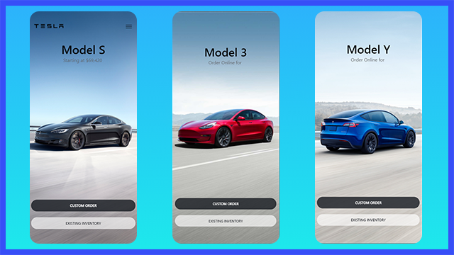

# Mini Project: Tesla Clone

## Date: 10 - Jan - 21

### Functions

- View list of Tesla Car

### Screenshot

- 

### Tech-Stack

- React Native
- Expo

### Plan Of Action

- Prerequisites
  - Install Expo CLI
  - Install Expo client
- Init the project
- Render first content (View, Text)
- Background Image
- create `CarItem` component
- create `button` component
- React Props for `button` component
- Props for `CarItem` component
- Render a list of items: FlatList
- FlatList Snap effect
- Header component
- write document

### After this project

I have understand about

- Basic React Native
- Render component with View
- Render List of item by FlatList
- Scroll Snap effect in FlatList

### Set up

Use the cmd line to clone repo to your computer

```
git clone [github_repo_url]
```

Use the cmd line to install dependencies.

```
yarn install
```

Run in cmd for start the dependencies server

```
yarn start
```
